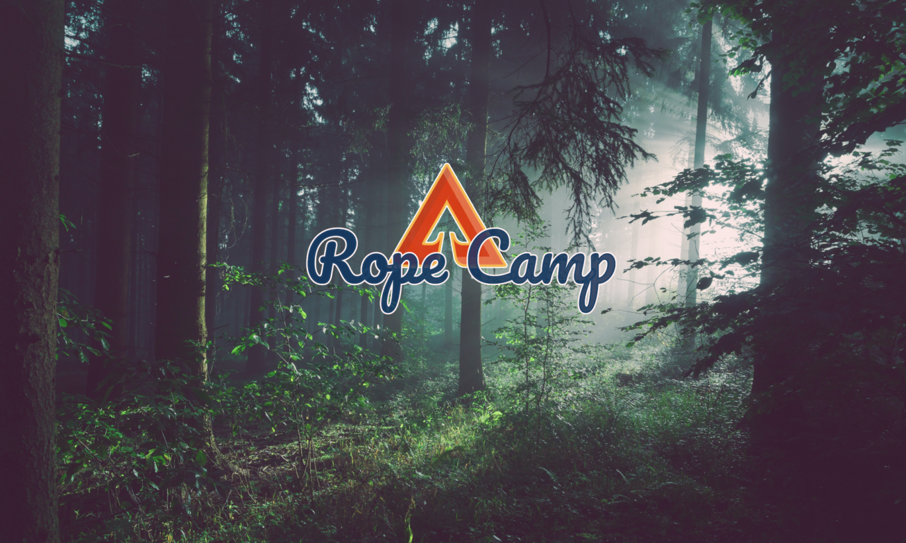

# What's this rope camp?

## What's this rope camp?

### The very short details

* **When:** 13/08/2020 16.00 -&gt; 16/08/2020 16.00
* **Where:** Near Vielsalm
* **Cost:** +/- 100€ 
* **Tickets:** Shop will open around 11/05/2020

### Intro

Since there wasn't anything happening during the lock-down and the foresight of a completely event-less summer scared me, I decided to set up this camp.

Added by the fact that the C-thing prevented me of getting any form of Rogue Rope events going. The 'organizer' in me started to have a little itch. Fueled with the isolation of being at home, and a freshly installed computer I developed the idea, found a location and planned the basic infrastructure so far.

The setup is volunteer driven, **everyone needs to participate.**

This means: helping with food-preparation, cleaning, making content, taking care of each other.

### What does Rogue Rope provide?

Rogue rope is focused on infrastructure: we provide a space, a place to pitch your tent, stuff to eat and drink. Suspension points. A sound-system. Water and power, toilets and warm showers.

We don't provide: shows, workshops, entertainment. This is up to the participants.

### What does the participant provide?

This is not a festival where there's a divide between the audience and the artists on stage.

This is a playground with a bunch of toys, an empty dance floor waiting to be filled.

We create the stage, but **you the participant** performs the show.

