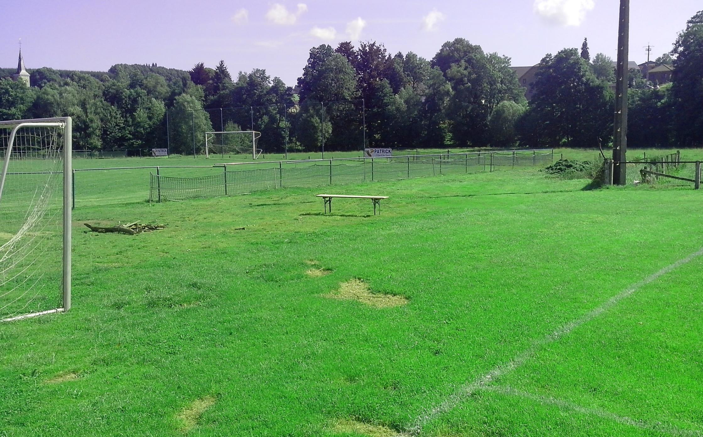

# Yes, bring your tent!

As you can see, it's basic, with room for making a fire, bring your guitar and marshmallows. We'll get electricity to the campsite, if you want to get hooked up bring the longest extension cord you have and a power strip.

So you can charge your mobile devices while you sleep. We will also try to get WiFi to cover the campsite

Other stuff to bring: 
* Your Christmas lights!  Or other cool led strips. Let's make it funky at night.
* Toilet/shower facilities are indoor, so no smelly Dixie-toilets. 
* No need to bring dodgy gas stoves or other cooking gear, we will provide you with food.
* As mentioned, there will be a campfire-site. Please try to limit smoking to that area, fire safety is important.
* If your smoke smells a bit funny, that's fine, no need to hide it in your tent.

## Is there a possibility to sleep inside? 

This depends, there is some room inside where you should be able to put an air mattress. For the moment, I'll reserve those spots for volunteers that do a lot of kitchen shifts. 

So ask not what rope camp can do for you, ask yourself what you can do for rope camp! Let us know maybe we'll be able to make a deal. 