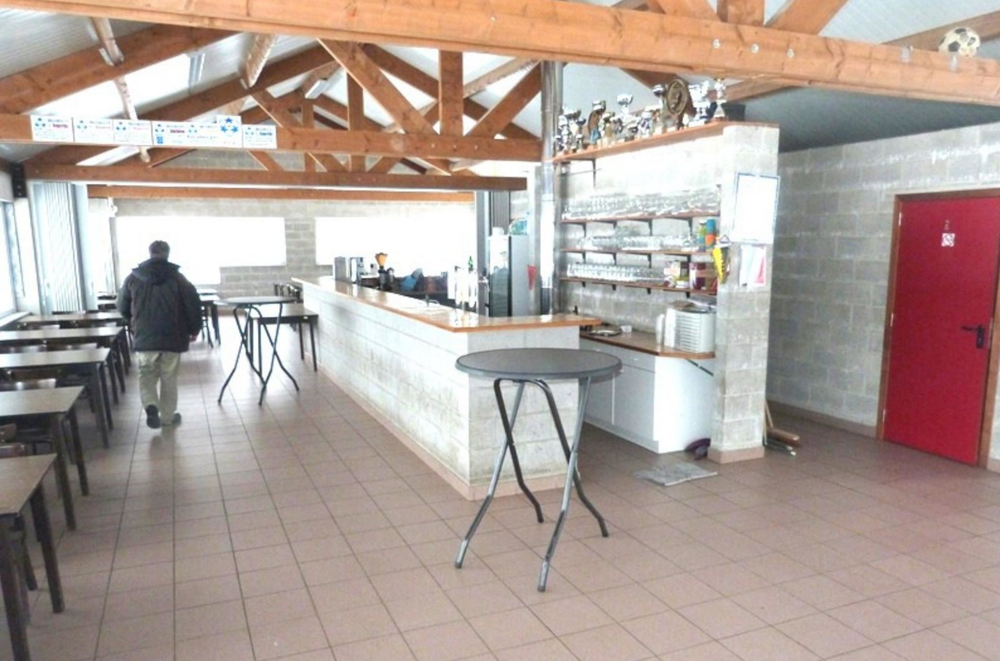
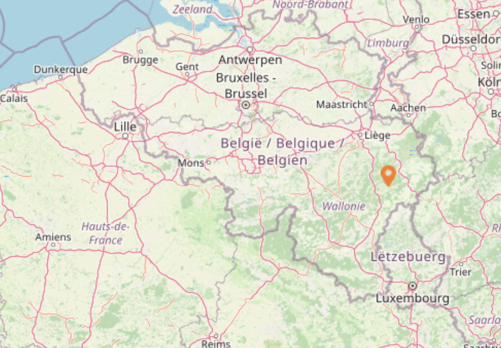

# Site

## Main building

That's right! What you might see is a football joint, what I see is an open space. Room to chill outside, bars and fridges.

It is also allowed to make a fire, we get bare wood from the forest nearby. Also in the area: point of water where swimming is permitted.

## Main room site

This is the pic that sold me on the property. I'm sure I don't have to tell you why. ;-\)

## Shower setup

There are changing rooms with showers, from what I've heard there should be enough warm water for everyone.

## Map

The street is one-way. The site is located between a train track and trees. It's near Vielsalm, you will get the exact location after payment, a few weeks before the event. There's a lot of parking space. If you want to come with a camper car, feel free.

